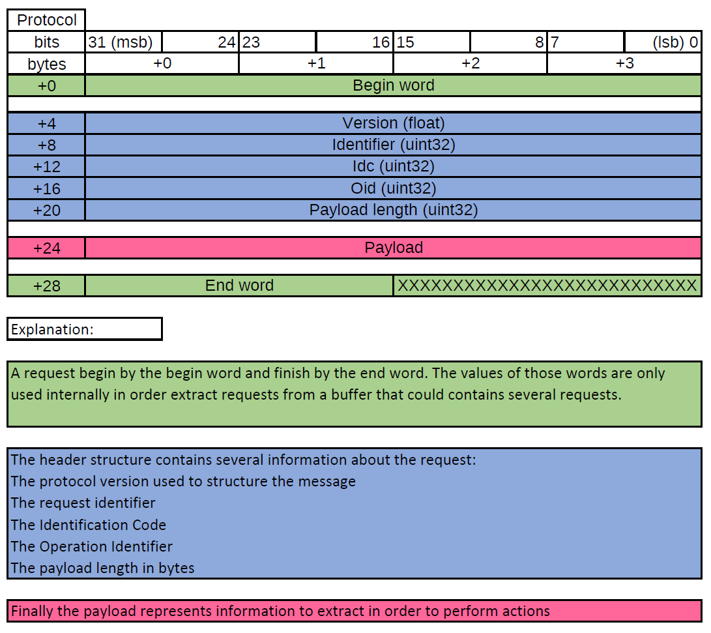
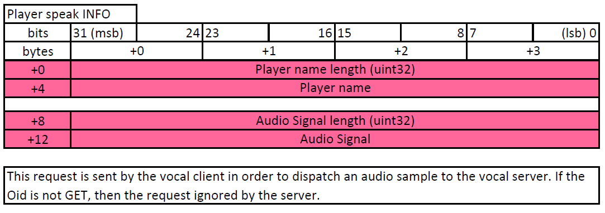
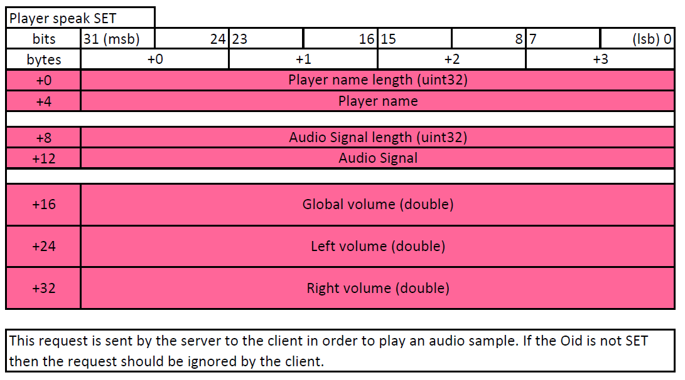

# Presentation

This project gather requests shared by a vocal client and a vocal server. Indeed, in order to be sure that requests sent by the client to the server and requests sent by the server to a client are supported by both client and server, there is a shared project in order to store requests. It is the objective of this project.

# Download

First you need to download this project on your computer. To do so, you can use the following command line :

```git
git clone -b 1.0-SNAPSHOT https://github.com/Pierre-Emmanuel41/vocal-common.git --recursive
```

and then double click on the deploy.bat file. This will deploy this project and all its dependencies on your computer. Which means it generates the folder associated to this project and its dependencies in your .m2 folder. Once this has been done, you can add the project as maven dependency on your maven project :

```xml
<dependency>
	<groupId>fr.pederobien</groupId>
	<artifactId>vocal-common</artifactId>
	<version>1.0-SNAPSHOT</version>
</dependency>
```

# Protocol

In order to send requests to the vocal server and to parse the response, a protocol has been defined based on the architecture provided by the project messenger.



# Supported requests : Player Speak

It is the request to send to the server when a player is speaking.

Idc: <code>PLAYER_SPEAK</code> (value = 0).  
Supported Oid: <code>INFO</code> (value = 0), <code>SET</code> (value = 1).  

The payload structure is different according to the Oid:

* <code>GET</code>

Payload structure when sent:



It is recommended to the developer to read this [file](https://github.com/Pierre-Emmanuel41/sound/blob/master/src/main/java/fr/pederobien/sound/impl/SoundConstants.java) in order to know the properties of the audio signal.  

Payload structure when received: No such request with oid GET can be received from the server.

```java
// Client Side -----------------------------------------------------------------------
// Instantiating a factory in order to generate/parse requests
VocalMessageFactory clientFactory = VocalMessageFactory.getInstance(0);

// Received from the microphone
byte[] bytes = new byte[1024];
IVocalMessage message = clientFactory.create(Idc.PLAYER_SPEAK, Oid.INFO, "Player 1", bytes);

// Server Side -----------------------------------------------------------------------
// Instantiating a factory in order to generate/parse requests
VocalMessageFactory serverFactory = VocalMessageFactory.getInstance(100000);

// Received from the remote
byte[] buffer = new byte[1024]
PlayerSpeakInfoMessageV10 parsed = (PlayerSpeakInfoMessageV10) serverFactory.parse(buffer);
```

* <code>SET</code>

Payload structure when sent: Request ignored.

Payload structure when received:



The combination of the player name length and player name correspond to the player that is currently speaking. The combination audio signal length and audio signal correspond to the audio signal the client associated to the player is sending to the server.  
The global volume correspond to the global volume of the audio signal calculated by the server. The left and right volume correspond to the stereo effect of the signal. Those two values are also calculated by the server.

```java
// Server Side -----------------------------------------------------------------------
// Instantiating a factory in order to generate/parse requests
VocalMessageFactory serverFactory = VocalMessageFactory.getInstance(10000);

// Fake Audio sample
byte[] audioSample = new byte[1024];
IVocalMessage message = serverFactory.create(Idc.PLAYER_SPEAK, Oid.SET, "Player 1", audioSample, 1.0, 0.123, 0.456);

// Client Side -----------------------------------------------------------------------
// Instantiating a factory in order to generate/parse requests
VocalMessageFactory clientFactory = VocalMessageFactory.getInstance(0);

// Received from the server
byte[] bytes = new byte[1024];
PlayerSpeakMessageSetV10 parsed = (PlayerSpeakMessageSetV10) clientFactory.parse(bytes);
```

Nota Bene : The <code>VocalMessageFactory</code> should be instantiated only once and reused each time a request should be generated/parsed. Indeed, there is an internal identifiers management that increases the global identifier each time a request is generated.